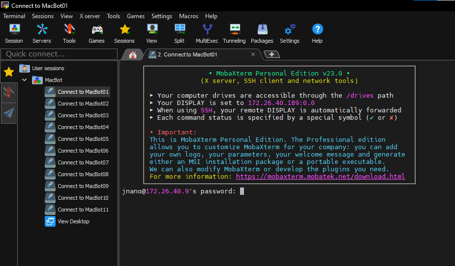
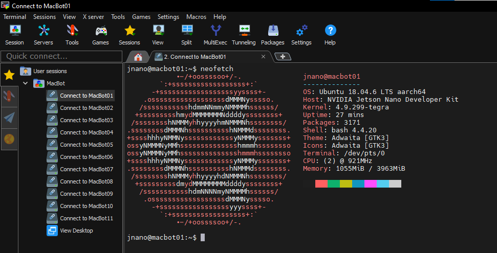
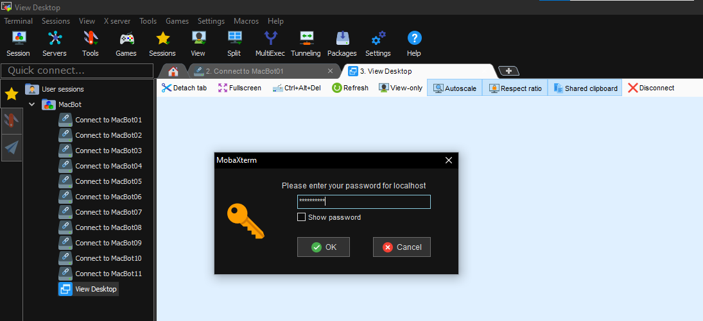
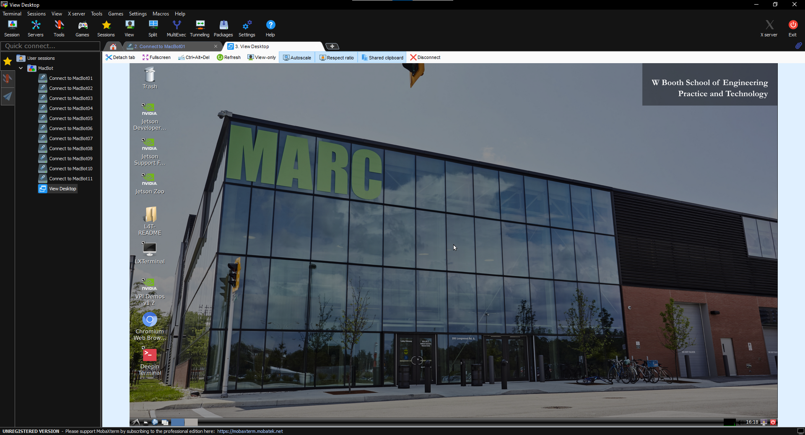

# 🔌 Connect

## Install MobaXTerm


Home Edition, Windows Installer


Use 7Zip or Windows Zip Extractor to extract the compressed folder into the Downloads/ folder

<figure><figcaption></figcaption></figure>

Run the MobaXTerm MSI installer with the default install configuration.

<figure><figcaption></figcaption></figure>

## MobaXTerm Session

Download the following session file to your Downloads/ folder. It contains the pre-configured environment for establishing an SSH tunnel to and streaming a graphical interface from each MacBot.



Open MobaXTerm and load the downloaded session file.

<figure><figcaption></figcaption></figure>

<figure><figcaption></figcaption></figure>

## Connecting to the MacBot

Ensure that you are connected to Mac-WiFi.

<figure><figcaption></figcaption></figure>

Ensure that your MacBot is powered ON and booted by waiting 2 minutes.

Click **Connect to MacBot##**.

<figure><figcaption></figcaption></figure>

Enter the password for your MacBot, which can be found here:


[setup.md](setup.md)


When prompted to save the password, always select **No**.

<figure><figcaption></figcaption></figure>

Run neofetch to verify that you are connected to the correct machine.



```bash
neofetch
```



```
sudo apt -y install neofetch
```



<figure><figcaption></figcaption></figure>

Ensure that the VNC server is running on port 5902 using the following command:

```bash
vncserver -list
```

<figure><figcaption></figcaption></figure>

Connect to the MacBot by pressing the **View Desktop** button.

<figure><figcaption></figcaption></figure>

You will be prompted for your password once more. Press **OK**.

After a few moments, you will be able to see and interact with your desktop.

<figure><figcaption></figcaption></figure>

Click **Fullscreen** and untoggle **Always on Top**.

<figure><figcaption></figcaption></figure>

You can now use **TAB + Windows** to toggle between your open tabs

<figure><figcaption></figcaption></figure>
